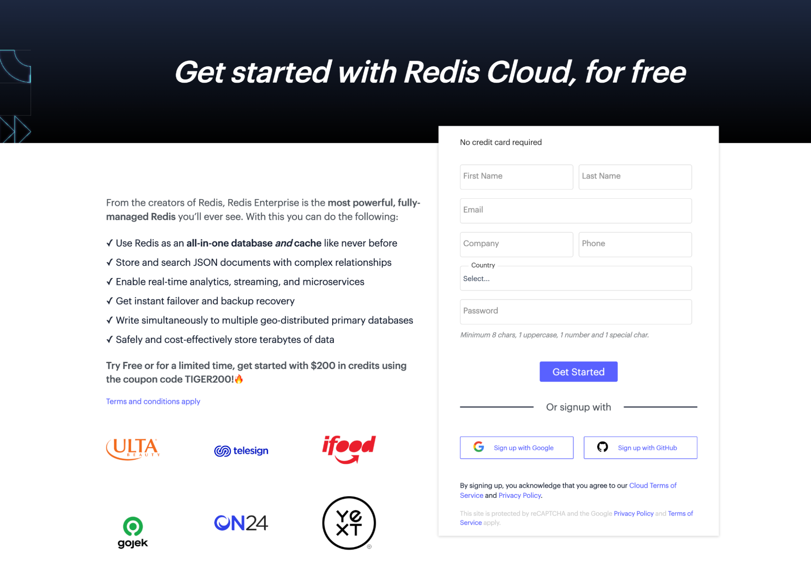
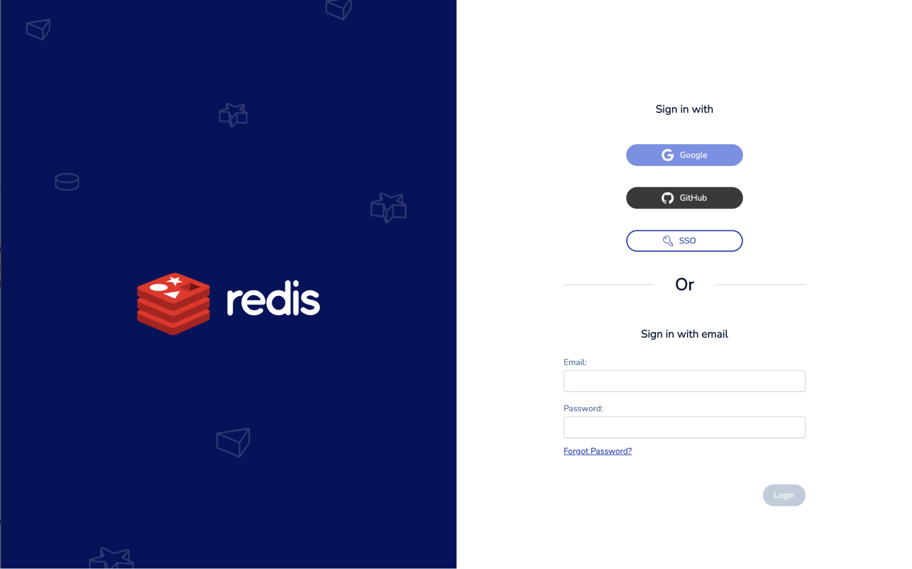
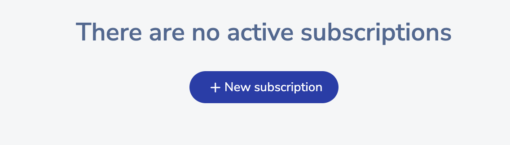
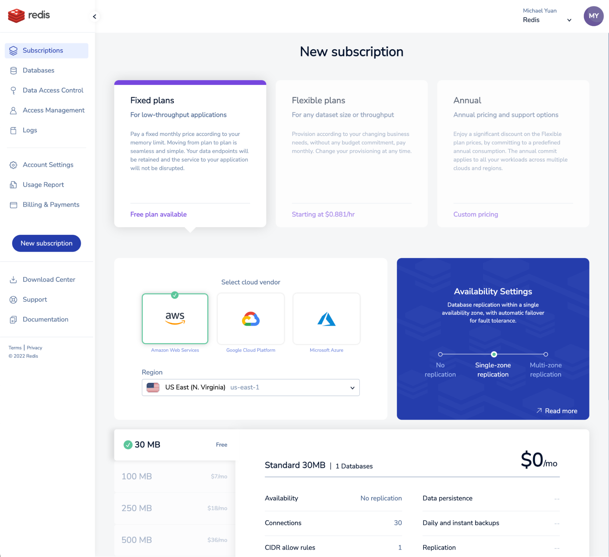
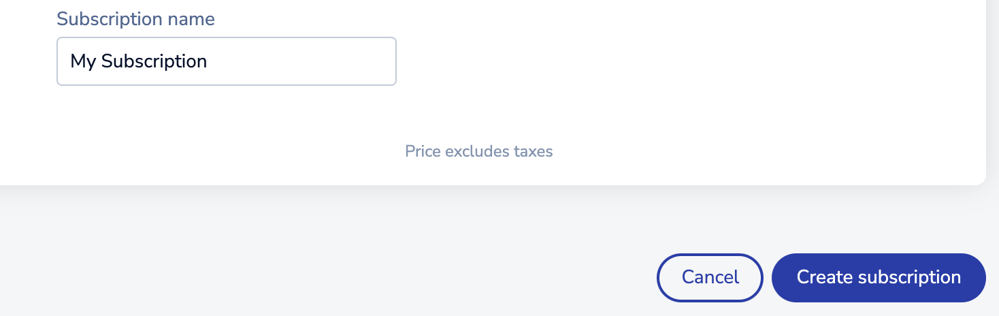
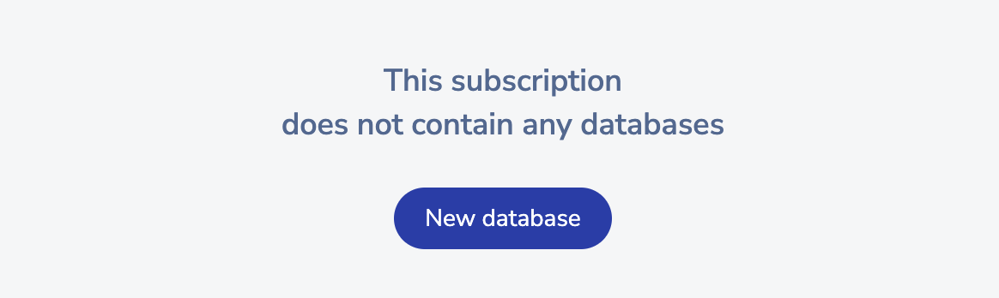
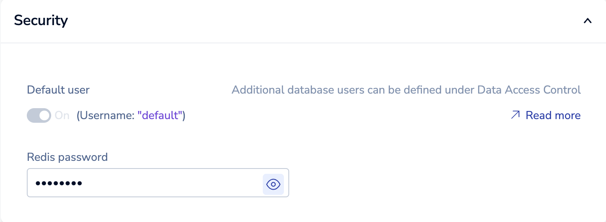
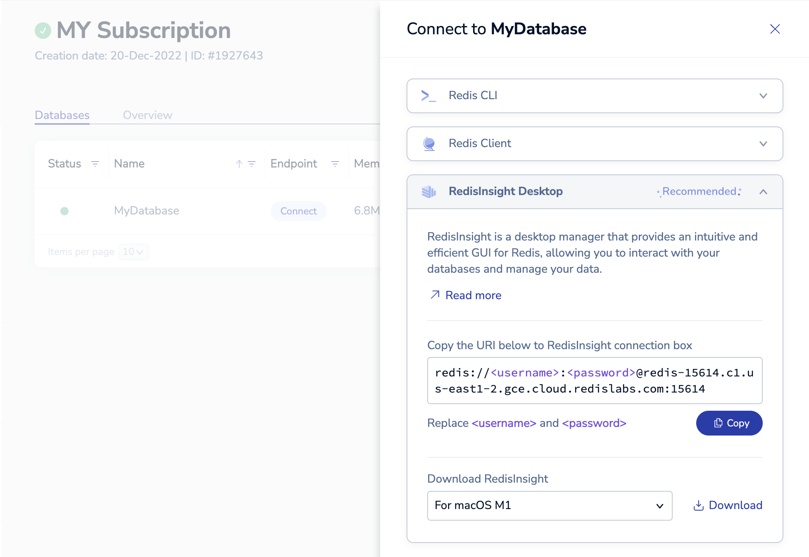
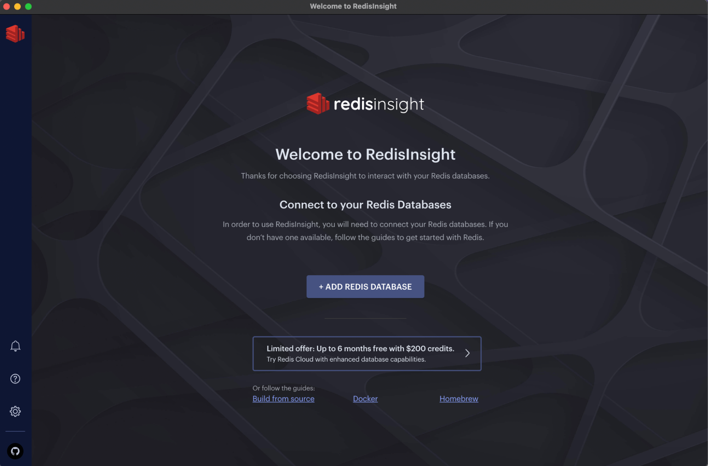
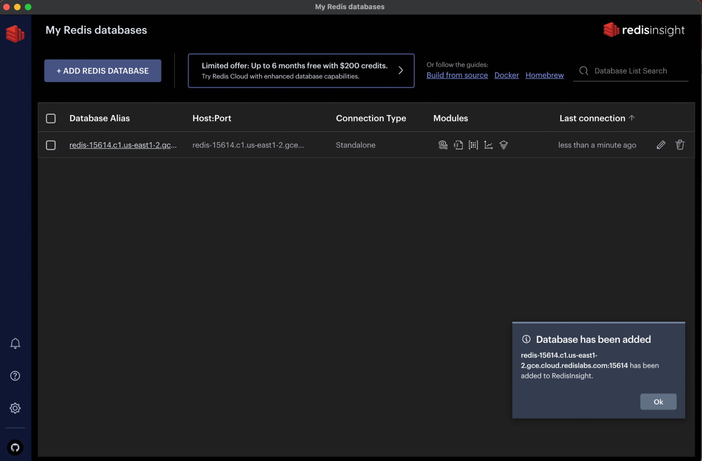

# SetUp your Redis Environment (< 10 minutes)

This notebook serves as a guide for setting up a Redis environment, including creating a Redis Cloud subscription, configuring a database, and installing RedisInsight Desktop for database management. 

It also provides instructions for preparing the Python environment for the workshop by installing the required packages and setting up the connection to the Redis database.

## 1. Sign up for Redis Cloud trial

Visit [https://redis.com/try-free/](https://redis.com/try-free/) and sign-up for a free trial:



## 2. Verify your account via email


## 3. Login with your new credentials



## 4. Click "+ New Subscription" to add a new subscription to your account



## 5. Choose a free Fixed plan with your preferred cloud provider and region



## 6. Name your subscription and click "Create Subscription"



## 7. Create a new database under your subscription



## 8. Name your database and select type "Redis Stack"


## 9. Set a password for your database



## 10. Activate your new database


## 11. Download RedisInsight Desktop on your laptop



## 12. Install RedisInsight Desktop on your laptop


## 13. Open RedisInsight Desktop and add a new database



## 14. Copy the URI details of your new database and paste it in RedisInsight


## 15. Your Redis database is now added and ready to use



## 16. Your environment is prepared for the workshop labs


## 17. Python Setup

### Virtual Environment

```bash
python3 -m venv .venv
source ./.venv/bin/activate
pip install redis
```

### Modules Needed

``` python
from redis import from_url
```

### Connect Client

```python
        user = 'your user'
        pwd = 'your password'
        url = 'your url'
        port = 'your port'
    
        client = from_url(f'redis://{user}:{pwd}@{url}:{port}')
        print(client.ping())
```

### Result

```bash
True
```